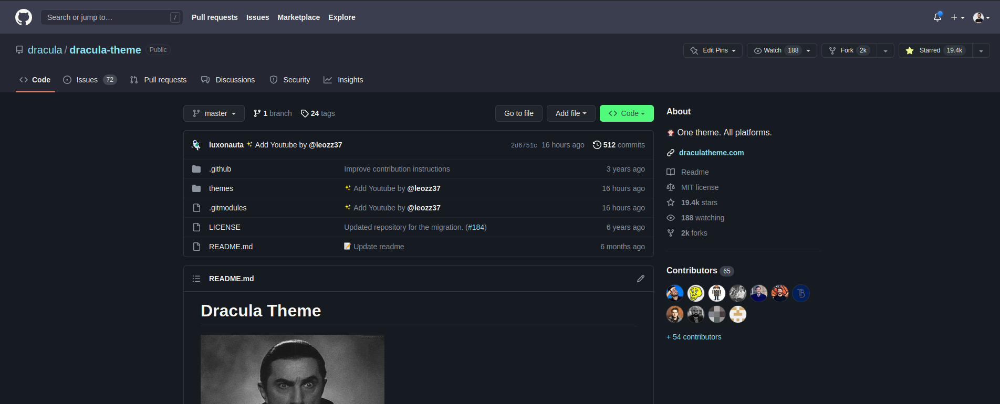

# Dracula for [GitHub](https://github.com/)

> A dark theme for [GitHub](https://github.com/).

## Install

All instructions can be found at [draculatheme.com/x](https://draculatheme.com/github).

## Team

This theme is maintained by the following person(s) and a bunch of [awesome contributors](https://github.com/dracula/template/graphs/contributors).

 |
--- |
[Gustavo Pereira](https://github.com/oguhpereira) |

## License

[MIT License](./LICENSE)